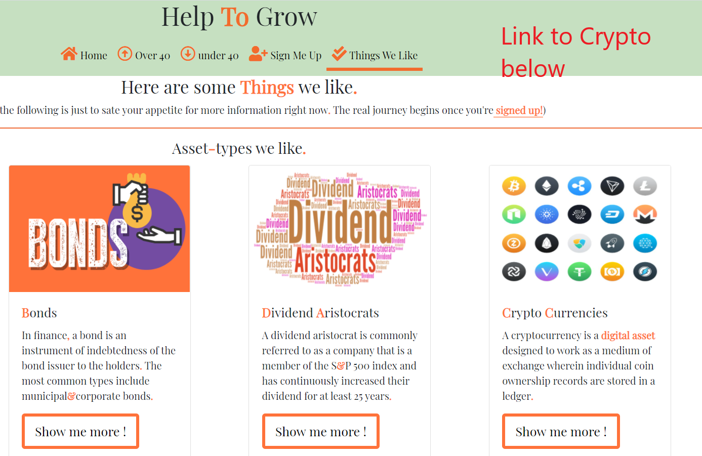

# Project name: Help to Grow 
The project aim is to enable new investors to clear what are often the two most daunting hurdles.
* Upfront capital 
* Readily available, reliable and custom, information.

What separates ‘Help To Grow’ form the other websites is our immediate dealing with the aforementioned hurdles.
* Our model employs a subscription base as opposed to a lengthy commission based contract. 
* We offer users immediate access to qualified advisors once signed up to our community

We hope to scale the model out beyond the republic of Ireland to the wider European catchment market which will require a broadening of our in-house professionals.

Professionals are compensated via the subscription charge. As part of their re-numeration they are expected to create helpful content in their relevant field, engage with the community at weekly q&a’s, and ensure their own qualifications valid throughout their involvement.

Professionals are advised to advertise private mentoring sessions with the community for a fixed, pre-agreed-upon, fee in order to expand their own client base and ultimately the return value of remaining apart of Danco: Community investors site.

## UX
The website is targeted at new users, and initially splits them into two categories for easy, example representation. 
* Over Forty
* Under Forty

We then offer simple examples of available options to both categories, with a push toward the greater rewards that accompany membership.
New investors come with a myriad of varying questions, so we aim to keep the initial experience concise while also demonstrating our knowledge and how we can help.

### User Story 1
> I only have €100 to invest each month and I want to buy Bit-Coin.

We can offer verified exchanges on which to trade, guidance on relevant asset-type trends and pitfalls, a personalized portfolio growth strategy, and advise on specific tax obligations.  

There are very few, if any, Irish based advisors who would entertain this user’s needs.

### User Story 2
> I have a pension, isn’t that enough?

While pensions are highly tax efficient they are not without their pitfalls
* The government can, and has, raided private pensions in recessionary times. 
* Most providers demand a1-3% annual commission even if your investment value falls. Not to mention other costs like allocation/ management fees. 
* By their nature they have a long time horizon with sharp penalties for early access in case of emergency. 

Depending on the users age and end-goals, our community offers a personalized diversification strategy to ensure our investors avoid the big mistakes people often make with a pension-only approach.

### Wireframes
Wireframes pdf’s are included in the project in a separate folder appropriately marked ‘wireframe’. 

## Features
### Existing Features
 Index : We declare who we’re for, and the benefits of joining. We’re upfront about the cost and provide a link to a quick example.
* Forty + : Our recommendations are clear, with a promise of more.
* Forty - : Mirroring ‘Forty +’ we simultaneously demonstrate an alternative route depending on age, and highlight the futility of a one-size-fits-all approach.
* Sign Me Up : we offer a quick and easy sign up, requiring only an email address and confirmation the user has read our disclaimer. We also provide an optional space to share addition information.
* Things We Like : Here again demonstrate our commitment to a varied approach to investing by sharing a range of options we can help the user with. 
* Footer : Links provided to our existing social medias, as well as closed links to our upcoming additions (podcast, discord )

### Features left to implement 
Sign Me Up: We would like to allow users sign up in full on this page by implementing some back-end structure and incorporating a secure direct payment method.

Over-all : To ensure adequate revenues we want to monetize affiliate links and advertising.

## Technologies used
* [Git-Hub](https://github.com) -For deployment
* [Git Pod](https://github.com) -IDE
* [Bootstrap](https://getbootstrap.com) -Utilized for correct scaling on mobile devices and buttons.
* [Font Awesome](https://fontawesome.com) -Used for all icons.
* [Google Fonts](https://fonts.google.com) -Used for primary font employed throughout.
* [Visual Studio](https://code.visualstudio.com) -For offline work.

## Testing
### Links and Form
There are currently no automatic tests employed. Such test are marked for later development.
All internal and external links manually tested on each of the five pages. 
Sign up form tested as follows
* Go to Sign Me Up
	* Entered invalid email
		* Warning displayed
* Enter valid email, but left disclaimer check-box empty 
	* Warning displayed
* Entered valid email and checked the disclaimer box
	* Sign up successful

### Screen sizing
Using GoogleChrome developer tool
* The website scales evenly all the way down to screen-size 425x635.
* At 375x635 and 320x635 the header and footer icons start to bunch although not so much as to overtly disrupt the UX. This too is marked for later development.

Using FireFox developer tool
* The website scales evenly all the way down to screen-size 425x635. 
* At 375x635 and 320x635 the header and footer icons start to bunch although not so much as to overtly disrupt the user’s experience. This too is marked for later development.
* The Zoom function on links not working in FireFox—also marked for later development.

## Deployment
Git-hub used for deployment.
Process as follows
* Select ‘MS1-HELP-TO-GROW’
* Got to ‘Settings’
* Scroll down to ‘GitHub pages’
* [Link to site](https://firmodaniel.github.io/MS1-HELP-TO-GROW/)

## Credits
### Content
Header quotes taken from google search results of‘Financial Quotes’
### Media
Background image – taken from [Freepik](https://www.freepik.com)
### Aknowldgements 
I received inspiration for this project from Code Institute -Love Running- tutorial, which is why I opted for background images behind the header quotes rather than inserted images.

