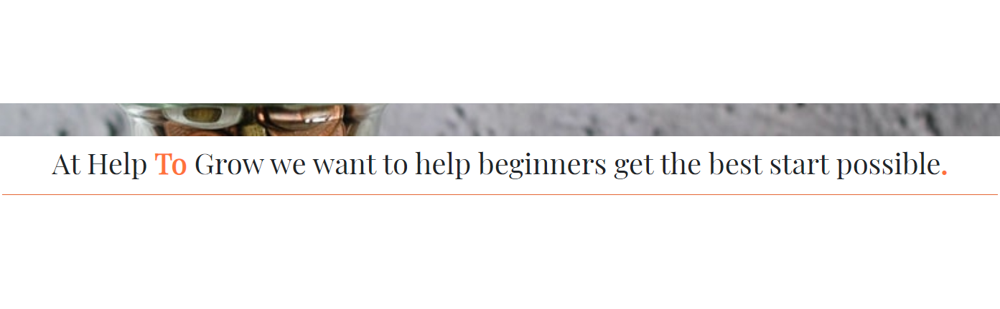
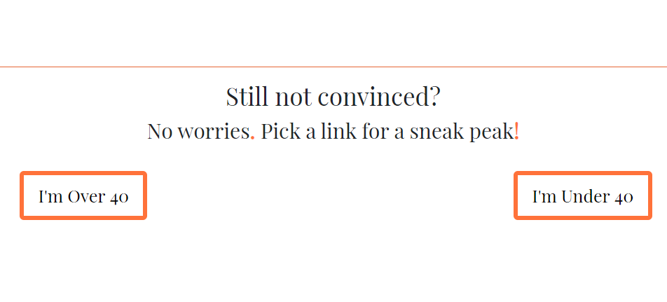
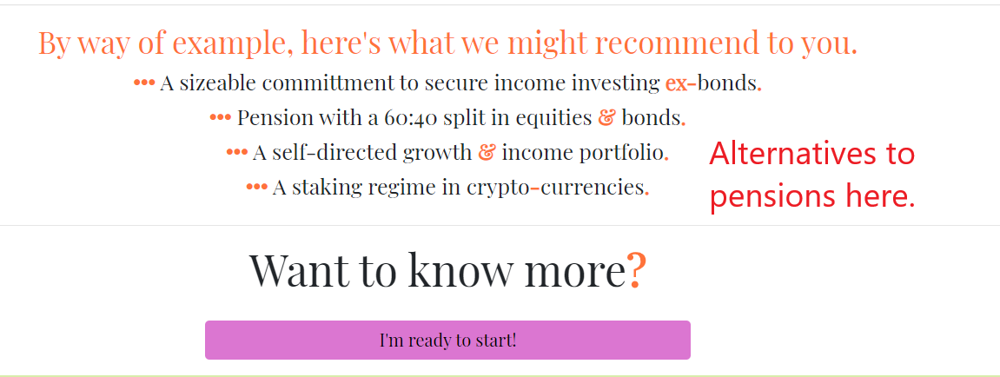
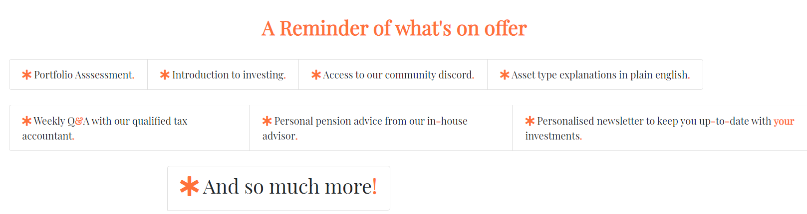

# Project name: Help to Grow 
The project aim is to enable new investors to clear what are often the two most daunting hurdles.
* Up-front capital 
* Readily available, reliable and custom, information.

What separates ‘Help To Grow’ from the other websites is our immediate dealing with the aforementioned hurdles.
* Our model employs a subscription base as opposed to a lengthy commission based contract. 
* We offer users immediate access to qualified advisors once signed up to our community.

We hope to scale the model out beyond the republic of Ireland to the wider European catchment market which will require a broadening of our in-house professionals.

Professionals are compensated via the subscription charge. As part of their re-numeration they are expected to create helpful content in their relevant field, engage with the community at periodic q&a’s, and ensure their own qualifications remain valid throughout their involvement.

Professionals are advised to advertise private mentoring sessions with the community for a fixed, pre-agreed-upon, fee in order to expand their own client base and ultimately the return value of remaining apart of Help to Grow site.

A live version can be found [here](https://firmodaniel.github.io/MS1-HELP-TO-GROW/).

## UX

The website is targeted at new users, and initially splits them into two categories for easy, example representation. 
* Over Forty
* Under Forty

We then offer simple examples of available options to both categories, with a push toward the greater rewards that accompany membership.
New investors come with a myriad of varying questions, so we aim to keep the initial experience concise while also demonstrating our knowledge and how we can help.

### Initial visit : User Story 1
* Upon my initial visit:
    * I want to see the natural navigation links.
        * _**Site response:**_ : Standard header and footer placement greet users.
    * I want to find a clear site goal to ensure this is the site for me. 
        *   _**Site response:**_ : Our goal is prominetly displayed on the landing page. 
    * I do not want to be overloaded with financial data or immediate calls to action.
        * _**Site response:**_  The site uses cards with images to exhibit the offer without bombarding the user.

### Initial visit : User Story 2
> I only have €100 to invest each month and I want to buy Bit-Coin.

* Upon my inital visit:
    * I am looking for help buying a specific asset. Can this site help?
        * _**Site response 1**_ : Our landing page contains two links. Both highlight a path to Cryptocurrency  
        * _**Site response 2**_ : We also offer addition information on our 'Things we like' page. 

### Initial visit : User Story 3
> I have a pension, isn’t that enough?

 * Upon my inital visit:
    * I am wondering if I need more than a standrad pension.
        * _**Site response**_ : Our landing page contains two links. Both highlight pensions but only as part of an overall portfolio. An example of which can be seen below.

### Returning visit :
* Upon my return visit:
    * I want to sign up.
        * _**Site response**_ : The 'Sign Me Up' page is quickly accessible via the header navigation bar. A reminder of membership benefits is also prominent.
        

### Wireframes
First draft wireframe pdf’s are included in the project. The main variation from the first drafts was the addition of cards to the 'index' and 'things we like' pages.
* [index](wireframe/wireframe-index-first-draft.pdf)
* [over-forty](wireframe/wireframe-over-forty-first-draft.pdf)
* [under-forty](wireframe/wireframe-under-forty-first-draft.pdf)
* [sign-me-up](wireframe/wireframe-sign-me-up-first-draft.pdf)
* [things-we-like](wireframe/wireframe-things-we-like-first-draft.pdf)

## Features
### Existing Features
Overall the site is responsive and scales with user screen size. The site follows Orange (#ff4800c5) with black colour theme throughout.  
* Index : Features a background image repeated throughout. Cards with images from Bootstrap. Quotes which follow a fixed style but vary in text. Info on all [here](#credits). There are links at page end to promt users deeper into the site. 
* Forty + : Contains a compact list of suggestions based on users selected age group. Page end contains a link to sign up.
* Forty - : Mirroring the 'Forty +' here we display an altered list of suggestions based on users selected age group. Page end contains a link to sign up.
* Sign Me Up : we offer a quick and easy sign up, requiring only an email address and confirmation the user has read our disclaimer which is linked in the form. We also provide an optional space to share addition information. Page end contains a link to further information on the 'Things We Like' page.
* Things We Like : The information is organised into cards with images. Info on all [here](#credits). There is also a minor push to sign up via a link at page top-right.
* Footer : Links provided to fictional social medias.

### Features left to implement 
Sign Me Up: We would like to allow users sign up in full on this page by implementing some back-end structure and incorporating a secure direct payment method.

Over-all : To ensure adequate revenues we want to monetize affiliate links and advertising.

## Technologies used
* [Git-Hub](https://github.com) -For deployment
* [Git Pod](https://github.com) -IDE
* [Bootstrap](https://getbootstrap.com) -Utilized for correct scaling on mobile devices and buttons.
* [Font Awesome](https://fontawesome.com) -Used for all icons.
* [Google Fonts](https://fonts.google.com) -Used for primary font employed throughout.
* [Visual Studio](https://code.visualstudio.com) -For offline work.
* Lighthouse.
* responsive viewer.

## Testing
### Links and Form
There are currently no automatic tests employed. Such test are marked for later development.
All internal and external links manually tested on each of the five pages. 
Sign up form tested as follows
* Go to Sign Me Up
	* Entered invalid email
		* Warning displayed
* Enter valid email, but left disclaimer check-box empty 
	* Warning displayed
* Entered valid email and checked the disclaimer box
	* Sign up successful

### Screen sizing
Using GoogleChrome developer tool
* The website scales evenly all the way down to screen-size 425x635.
* At 375x635 and 320x635 the header and footer icons start to bunch although not so much as to overtly disrupt the UX. This too is marked for later development.

Using FireFox developer tool
* The website scales evenly all the way down to screen-size 425x635. 
* At 375x635 and 320x635 the header and footer icons start to bunch although not so much as to overtly disrupt the user’s experience. This too is marked for later development.
* The Zoom function on links not working in FireFox—also marked for later development.

## Deployment
Git-hub used for deployment.
Process as follows
* Select ‘MS1-HELP-TO-GROW’
* Got to ‘Settings’
* Scroll down to ‘GitHub pages’
* [Link to site](https://firmodaniel.github.io/MS1-HELP-TO-GROW/)

## Credits
### Content
Header quotes taken from google search results of ‘Financial Quotes’
### Media
* Background image [Sapling in jar of coins](https://images.unsplash.com/photo-1579621970590-9d624316904b?ixlib=rb-1.2.1&auto=format&fit=crop&w=1050&q=80)
* Card images- Index page.
    * [People-Whiteboard](https://images.unsplash.com/photo-1532622785990-d2c36a76f5a6?ixlib=rb-1.2.1&ixid=eyJhcHBfaWQiOjEyMDd9&auto=format&fit=crop&w=1050&q=80)
    * [Pen-Paper-Chart](https://images.unsplash.com/photo-1543286386-2e659306cd6c?ixlib=rb-1.2.1&auto=format&fit=crop&w=1050&q=80)
    * [People-Talking](https://images.unsplash.com/photo-1556761175-b413da4baf72?ixlib=rb-1.2.1&ixid=eyJhcHBfaWQiOjEyMDd9&auto=format&fit=crop&w=967&q=80)
    * [Money](https://images.unsplash.com/photo-1589556763393-59ab0f56b811?ixlib=rb-1.2.1&auto=format&fit=crop&w=1051&q=80)
    * [Yes](https://images.unsplash.com/photo-1560174971-443de64be852?ixlib=rb-1.2.1&auto=format&fit=crop&w=967&q=80)
    * [Meeting](https://images.unsplash.com/photo-1454165804606-c3d57bc86b40?ixlib=rb-1.2.1&ixid=eyJhcHBfaWQiOjEyMDd9&auto=format&fit=crop&w=1050&q=80)
* Card images - Things we like page.
    * [ETF image](https://thumbs.dreamstime.com/z/etf-exchange-traded-funds-concept-table-keywords-letters-icons-colored-flat-vector-illustration-white-etf-exchange-119009035.jpg)
    * [Bond image](https://www.investmentz.com/images/bond.png)
    * [Dividend Aristocrat image](https://www.allincomestream.com/wp-content/uploads/2020/04/dividend_aristocrats.png)
    * [Cryptocurrency image](https://i.pinimg.com/originals/4c/62/f5/4c62f589819458c32785ec9f2d69c026.jpg)
    * [Kraken image](https://themerkle.com/wp-content/uploads-new/2016/01/0WWCVDaH_400x400.png)
    * [Mintos image](https://3.bp.blogspot.com/-k5CiR2IQKG8/W4mpwPzi_uI/AAAAAAAAAGs/-fAFHT4zpqotg_Hz9fOicygrGiWNN--5ACLcBGAs/s640/Mintos_logo_1000px.png)
    * [Degiro image](https://upload.wikimedia.org/wikipedia/commons/thumb/6/68/Degiro.jpg/1200px-Degiro.jpg)
    * [MoneyCube image](https://i-invdn-com.akamaized.net/companies_logos/125067_1550587261.png)
    * [J.L. Collins image](https://the7circles.uk/wp-content/uploads/2016/06/Simple-Path-to-Wealth.jpg)
    * [Joseph Carlson image](https://cdn.podimo.com/images/02b1091b-7ec6-4812-b6b5-391bd091767f_400x400.png)
    * [Dave Ramsey image](https://pbs.twimg.com/profile_images/378800000250594141/8479b63c02b71130a03e218ae805ce85_400x400.png)
    * [Paddy Delaney image](https://ssl-static.libsyn.com/p/assets/a/6/a/3/a6a32c57b3d5361b/New_Podcast_Art_image.jpg)
### Acknowledgements 
I received inspiration for this project from Code Institute -Love Running- tutorial, which is why I opted for background images in the header quotes, and a neat footer.

